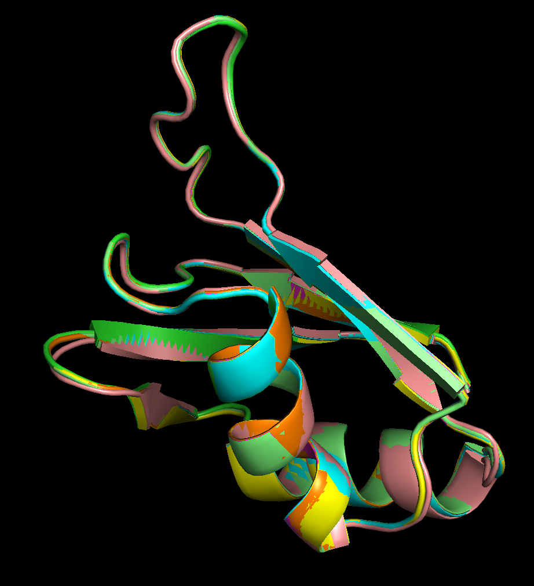
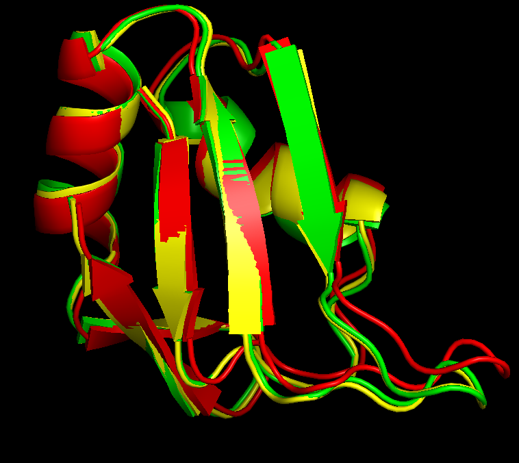
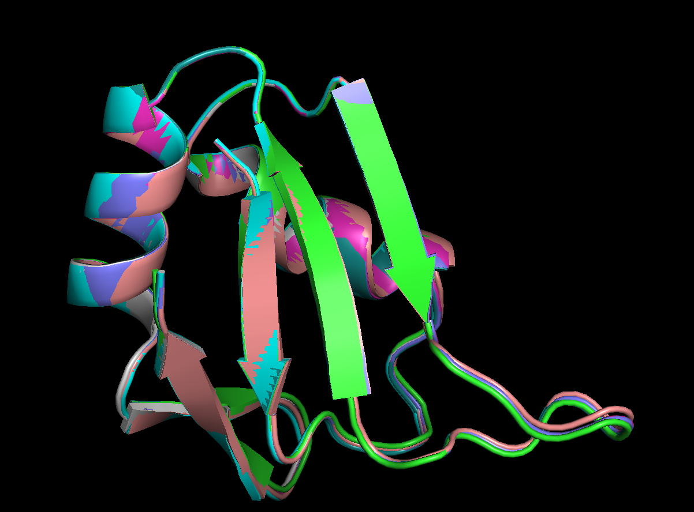

# Rosetta Protocol Exploration 

## Docker Image
1. Dowload docker image (9 GB total)
```angular2html
docker pull arnvsharma/metl-sim:latest
```
2. Give docker containers permission to access metl-sim folder on docker app.
3. Start a mounted docker container 
```angular2html
docker run -it -v /path/to/metl-sim/rosetta_protocol:/rosetta arnvsharma/metl-sim:latest /bin/bash  
```

4. Cd into `/rosetta/rosetta_protocol_metlv2` in the docker container. 

## Protocols 

To explore behavior of different protocols I will use the pab1 structure (`structure.pdb`). I will then introduce a mutation (`L55A` - 1 indexing in chain A) and run the FastRelax Protocol.

Below are all the flags for each experiment I ran. The first are changes to Sri's current protocol, followed by experiments on behaviors of interest. 

- Changes to current All Atom Relax Protocol
  - `flags_relax_v1` - Starting FastRelax Protocol (Cartesian Minimization) 
  - `flags_relax_v3` - Switch mutation scheme so all residues are repacked, not only the residue that was mutated. Add in flag to disable design.
Add flag to stop ignorning weight from xml script, from `ref2015` weights to `beta_nov16_cart`. 
- Side Experiments on Parameter behavior
  - `flags_default_max_cycles` -  Confirm behavior controls in some behavior related to the number of minimization steps. 
  - `flags_loops_minimize_max_iter` - Confirm this parameter does nothing.
  - `flags_relax_v3_nstruct_10` - The fixed v3 protocol, with 10 replicates to look at deviations in output. 
  - `flags_relax_v3_no_cart` - The fixed v3 protocol, now with no cartesian minimization.
  - `flags_restrict_repack` - The fixed v3 protocol, now with a radius restriction around the repacked residues.
  - `restrict_backbone_distance`
    - `flags_relax_restrict_backbone_10` - Fixed protocol with 10 angstrom backbone restriction in cartesian space. 
    - `flags_relax_restrict_backbone_10_no_cart` - Fixed protocol with 10 angstrom backbone restriction in non-cartesian space. 
    - `flags_relax_restrict_backbone_1000`- Fixed protocol with 1000 (basically no) angstrom backbone restriction in cartesian space. 
    - `flags_relax_restrict_backbone_1000_no_cart` -Fixed protocol with 1000 (basically no) angstrom backbone restriction in non-cartesian space. 


## Recommendations

1) Change current all atom relax script in `metl-sim` (flags_relax_v3)
2) Do sweep over `default_max_cycles`, `repeat`, `restrict_repack_distance`, and `restrict_backbone_distance`.


Some timing ideas are based on these recommendations from rosetta: https://docs.rosettacommons.org/docs/latest/getting_started/Rosetta-on-different-scales

## Outputs for each run
- console output: `<flag>.log` 
- pdb output: `<flag>_structure_0001.pdb`
- score file output: `<flag>.sc`


## Changes to the All Atom Relax Protocol


> Note: All protocols in these tests do 10 relax repeats. 
> Within each repeat minimization and repack is done 4 times (as shown in output log).
> So for 10 repeats, minimization and repack is done 40 times. 
> I did this to make sure that we would see movement of sidechains and backbone.
> However, the current number of repeats is 1. 
> We likely should test this in the same against 
> the default (recommended) 5 and see how much information is lost.


First we will run the original protocol. 
```angular2html
time rosetta_scripts @flags_relax_v1 > flags_relax_v1.log 2>&1

# xml: relax_v1.xml
# total_score: -296.429 
# timing on macbook m4: 
real    2m41.646s
user    2m40.981s
sys     0m0.274s
```

Things to note:

1) The protocol looks to be using the `ref2015` weights. 
Since no `-beta_nov16_cart` flag in command line. Below is a snippet of the relevant parts 
of the log file. 

```angular2html
core.scoring.ScoreFunctionFactory: [ WARNING ] **************************************************************************
*****************************************************
****************************************************
beta_nov16_cart may be a 'beta' scorefunction, but ScoreFunctionFactory thinks the beta flags weren't set.  Your scorefunction may be garbage!
**************************************************************************
*****************************************************
****************************************************


core.scoring.ScoreFunctionFactory: SCOREFUNCTION: ref2015
```

2) The repack only selects the mutated residue. The command `55 A PIKAA A`
in `mutation.resfile` only allows design at position 55, which restricts the allowed repacking. 

```angular2html
core.pack.interaction_graph.interaction_graph_factory: Instantiating PDInteractionGraph
protocols.relax.FastRelax: CMD: repack  -309.273  0.852702  0.852702  0.154
protocols.relax.FastRelax: CMD: scale:fa_rep  -290.813  0.852702  0.852702  0.17765
protocols.relax.FastRelax: CMD: min  -340.924  0.529202  0.529202  0.17765
protocols.relax.FastRelax: CMD: coord_cst_weight  -340.924  0.529202  0.529202  0.17765
protocols.relax.FastRelax: CMD: scale:fa_rep  -311.933  0.529202  0.529202  0.3124
core.pack.pack_rotamers: built 1 rotamers at 1 positions.
```

Fixed version: 

```angular2html
time rosetta_scripts @flags_relax_v3 > flags_relax_v3.log 2>&1
# xml: relax_v3.xml
# total_score:  -244.011 
# timing on macbook m4: 
real    2m28.583s
user    2m28.377s
sys     0m0.155s
```

Confirmation in relevant outputs.
```angular2html
# flags_relax_v3.log
core.scoring.ScoreFunctionFactory: SCOREFUNCTION: beta_nov16_cart.wts


protocols.rosetta_scripts.ParsedProtocol: =======================BEGIN MOVER MutateResidue - mutant=======================

core.pack.interaction_graph.interaction_graph_factory: Instantiating DensePDInteractionGraph
protocols.relax.FastRelax: CMD: repack  -258.971  0  0  0.022
protocols.relax.FastRelax: CMD: scale:fa_rep  -257.052  0  0  0.02805
protocols.relax.FastRelax: CMD: min  -343.672  0.776177  0.776177  0.02805
protocols.relax.FastRelax: CMD: coord_cst_weight  -343.672  0.776177  0.776177  0.02805
protocols.relax.FastRelax: CMD: scale:fa_rep  -201.588  0.776177  0.776177  0.14575
core.pack.task: Packer task: initialize from command line() 
core.pack.pack_rotamers: built 989 rotamers at 75 positions.

###  flags_relax_v3_structure_0001.pdb

ATOM    816  N   ALA A  55     -20.087  22.176  -1.051  1.00  0.00           N  
ATOM    817  CA  ALA A  55     -20.495  22.338   0.334  1.00  0.00           C  
ATOM    818  C   ALA A  55     -21.350  21.166   0.822  1.00  0.00           C  
ATOM    819  O   ALA A  55     -21.141  20.664   1.937  1.00  0.00           O  
ATOM    820  CB  ALA A  55     -21.261  23.632   0.488  1.00  0.00           C  
ATOM    821  H   ALA A  55     -20.380  22.857  -1.761  1.00  0.00           H  
ATOM    822  HA  ALA A  55     -19.594  22.378   0.946  1.00  0.00           H  
ATOM    823 1HB  ALA A  55     -21.537  23.770   1.531  1.00  0.00           H  
ATOM    824 2HB  ALA A  55     -20.635  24.461   0.158  1.00  0.00           H  
ATOM    825 3HB  ALA A  55     -22.158  23.589  -0.122  1.00  0.00           H  

```

## Looking at output structures for higher nstructsb (10) 

```angular2html
time rosetta_scripts @flags_relax_v3_nstruct_10 > flags_relax_v3_nstruct_10.log 2>&1
# xml: relax_v3.xml 
# total_score's in flags_relax_v3_nstruct_10.sc 
# timing on macbook m4:

real    23m27.171s
user    23m26.195s
sys     0m0.582s


```



This the 10 cartesian output structures. They all look to have a similar output structure. And their 
total_score is similar. 


## Not doing Cartesian minimization 

This is the same fixed protocol as above except with no cartesian minimization. 
```angular2html
time rosetta_scripts @flags_relax_v3_no_cart > flags_relax_v3_no_cart.log 2>&1
# xml: relax_v3_no_cart.xml
# total_score: -247.282 
# timing on macbook m4: 
real    0m29.787s
user    0m29.691s
sys     0m0.081s
```
Looking at the output structures we see it does look to move substantially more in non cartesian space. Perhaps due
to more degrees of freedom:



- Green, Starting pab1 structure.
- Red, No cartesian minimization of fixed relax protocol 
- Yellow, fixed relax protocol, cartesian minimization


Looking over 10 possible structures to see if they differ greatly in the non cartesian optimimization. 
```angular2html
time rosetta_scripts @flags_relax_v3_no_cart_nstruct_10 > flags_relax_v3_no_cart_nstruct_10.log 2>&1
# xml: relax_v3_no_cart.xml
# total_score's in flags_relax_v3_no_cart_nstruct_10.sc
# timing on macbook m4: 
real    4m20.432s
user    4m20.131s
sys     0m0.228s
```

The structures appear to converge to a similar solution and all have similar total_score's. 




## Parameter `-default_max_cycles`

This parameter, can be set by the user and is used in FastRelax. It controls the minimization steps. (not repack steps)

Confirmation of correctness from rosetta slack:
> Frank DiMaio Apr 22nd, 2021 at 11:54 AM
:this (at least on quick glance) looks good to me ... the only thing we do "differently" in relax is limit the max # of minimization cycles to 200.  This is controlled with a flag (-default_max_cycles) or through a relax "script file"  (https://new.rosettacommons.org/docs/latest/application_documentation/structure_prediction/relax#description-of-algorithm)


```angular2html
time rosetta_scripts @flags_relax_default_max_cycles > flags_relax_default_max_cycles.log 2>&1

# xml: relax_v3.xml
# total_score: -205.246  
# timing:
real    0m16.701s
user    0m16.619s
sys     0m0.068s


# flags_relax_default_max_cycles.log

core.pack.task: Packer task: initialize from command line() 
core.pack.pack_rotamers: built 986 rotamers at 75 positions.
core.pack.interaction_graph.interaction_graph_factory: Instantiating DensePDInteractionGraph
protocols.relax.FastRelax: CMD: repack  -220.445  0.00740673  0.00740673  0.30745
protocols.relax.FastRelax: CMD: scale:fa_rep  -218.551  0.00740673  0.00740673  0.31955
core.optimization.Minimizer: [ WARNING ] LBFGS MAX CYCLES 1 EXCEEDED, BUT FUNC NOT CONVERGED!
protocols.relax.FastRelax: CMD: min  -225.019  0.00778847  0.00778847  0.31955
protocols.relax.FastRelax: CMD: coord_cst_weight  -225.019  0.00778847  0.00778847  0.31955
protocols.relax.FastRelax: CMD: scale:fa_rep  -193.045  0.00778847  0.00778847  0.55

```

You can also confirm by looking in pymol at the comparison between the two structures 
and seeing no obvious minimization. Especially if set to 0.


## Parameter `-loops:minimize_max_iter`
```angular2html
time rosetta_scripts @flags_relax_minimize_max_iter > flags_relax_minimize_max_iter.log 2>&1
# xml: relax_v3.xml
# total_score: -245.195 
# timing:
real    2m38.303s
user    2m38.140s
sys     0m0.128s

```

Although read in by Rosetta arg parser, this parameter is not exposed to the Rosetta FastRelax protocol. 
For example, the C alpha carbons clearly moved despite setting 
this parameter to 0 which shouldn’t be possible in the only
repack setting.


## Parameter Restrict Repack 

First need to verify that the `ResidueSelector` we are using 
```angular2html
From Rosetta Docs: https://docs.rosettacommons.org/docs/latest/scripting_documentation/RosettaScripts/ResidueSelectors/ResidueSelectors

NeighborhoodResidueSelector
<Neighborhood name=(%string) resnums=(%string) distance=(10.0%float)/>
or

<Neighborhood name=(%string) selector=(%string) distance=(10.0%float)/>
or

<Neighborhood name=(%string) distance=(10.0%float)>
   <Selector ... />
</Neighborhood>
  
The NeighborhoodResidueSelector selects all the residues
  within a certain distance 
  cutoff of a focused set of residues.
It sets each position in the ResidueSubset that corresponds
  to a residue within a certain distance of the focused set
  of residues as well as the residues in the focused set
  to true, and sets all other positions to false.
```

It looks like the residue itself is also chosen. 
You can also confirm this by setting the distance to 0 Å and still 1 residue is selected for repacking.


```angular2html
time rosetta_scripts @flags_restrict_repack > flags_restrict_repack.log 2>&1
# xml: relax_v4.xml
# total_score: -232.386    
# timing: 
real    2m23.395s
user    2m23.247s
sys     0m0.105s
```

And we can confirm the output is only looking at 16-17 residues to pack rotamers,
it must find a new neighborhood after every run. 

```angular2html
# flags_restrict_repack.log
core.pack.pack_rotamers: built 139 rotamers at 16 positions.
core.pack.interaction_graph.interaction_graph_factory: Instantiating DensePDInteractionGraph
protocols.relax.FastRelax: CMD: repack  -217.146  0  0  0.03245
protocols.relax.FastRelax: CMD: scale:fa_rep  -215.458  0  0  0.0506
protocols.relax.FastRelax: CMD: min  -317.338  0.688015  0.688015  0.0506
protocols.relax.FastRelax: CMD: coord_cst_weight  -317.338  0.688015  0.688015  0.0506
```


## Parameter - Restrict Minimizer Distance

The restrict minimizer distance is controled by the movemap. 

There is a parameter in the MoveMapFactory which references cartesian output. So I had to make sure (1) that 
the minimizer was actually restricted. (pretty confident of this as in output logs). And (2) that the
cartesian minimizer was still being utilized. (https://docs.rosettacommons.org/docs/latest/scripting_documentation/RosettaScripts/MoveMapFactories/MoveMapFactories-RosettaScripts)


Timings from all runs constraining on restriction distance (10 or 1000-basically all atom), 
the <`no_cart`> flag is only included in the non-cartesian files.

```angular2html
time rosetta_scripts @flags_relax_restrict_backbone_<angsrom_distance>_<no_cart> > flags_relax_restrict_backbone_<angsrom_distance>_<no_cart>.log   2>&1
```

| Restrict Minimizer Distance | Cartesian Minimization | total_score (different score functions<br/> for cartesian and non-cartesian!) | Time     |
|--------------------------|------------------------|--------------------------------------------------------------------------|----------|
| 10                       | True                   | -185.467                                                                 | 33.609s  |
| 10                       | False                  | -229.976                                                                 | 16.660s  |
| 1000                     | True                   | -244.011                                                                 | 150.953s |
| 1000                     | False                  | -248.425                                                                 | 29.669s  |

Its very unlikely that the timing of the minimization (all atom) for cartesian is so long (almost the same as
before, but it would be using a non cartesian coordinate system). 

It looks like the non cartesian minimization is 5x times faster for the all atom relax at least for this 1 pab1 mutation. 

Visualizing the pdbs is a bit difficult as these atoms can still move. Either from the packer or from 
other atoms which move and then move them, but they themselves are never repacked. 
Luckily, the Cartesian minimization at 1000 looks nothing like the No cartesian minimization. 


To confirm that nothing is moving outside of a restricted distance, timings clearly show a reduction in complexity which is 
leading me to believe it is correct. Also the side chains outside of a 10 Å radius don't move nearly as much (which makes sense). 

Due to the output in the log, reduction of time, recommendations in rosetta scripts tutorials ,
and visually less movement I'm pretty confident the restriction in working correctly. 


Also in all logs without cartesian, no reference to this function `core.energy_methods.CartesianBondedEnergy`
during energy loading.


## Bringing all parameters together!

We want to have a protocol which can allow side chain repacking at some allowed distance, and backbone
minimization at some allowed distance.

Leaving the repack restriction at 10 Å otherwise it would be the same as the table above. 


```angular2html
 time rosetta_scripts @flags_relax_v6_<angsrom_distance>_<no_cart> > flags_relax_v6_<angsrom_distance>_<no_cart>.log   2>&1
```
Confirmation of restricted repack: 
```angular2html
core.pack.pack_rotamers: built 150 rotamers at 16 positions.
core.pack.interaction_graph.interaction_graph_factory: Instantiating DensePDInteractionGraph
protocols.relax.FastRelax: CMD: repack  -224.906  0.127632  0.127632  0.022
protocols.relax.FastRelax: CMD: scale:fa_rep  -224.128  0.127632  0.127632  0.02805
protocols.relax.FastRelax: CMD: min  -237.197  0.289991  0.289991  0.02805
protocols.relax.FastRelax: CMD: coord_cst_weight  -237.197  0.289991  0.289991  0.02805
protocols.relax.FastRelax: CMD: scale:fa_rep  -207.001  0.289991  0.289991  0.14575
```


| Restrict Minimizer Distance | Cartesian Minimization | total_score (different score functions<br/> for cartesian and non-cartesian!) | Time      |
|--------------------------|------------------------|-------------------------------------------------------------------------------|-----------|
| 10                       | True                   | -181.417                                                                      | 24.709s   |
| 10                       | False                  | -213.509                                                                      | 9.026s    |
| 1000                     | True                   |    -232.386                                                                             | 2m19.875s |
| 1000                     | False                  |     -248.106                                                                              |  18.680s         |


## Checking `code/prepare.py`

The two flags can turn off the cartesian minimization `--no_cart` and ramping constrainsts 
for the prepare `--no_ramping_constraints`. 

I'm using the default 5 relax repeats for the relax in the prepare. 

First we will run it with ramping constraints (recommended) and in cartesian space. (Look to `templates/prepare_wd_template` 
or output folder `rosetta_protocol_metlv2/output/prepare_outputs` for scripts.)
```angular2html
root@9a10c37e25b6:/rosetta# python code/prepare.py --rosetta_main_dir=/app --pdb_fn=rosetta_protocol_metlv2/structure.pdb --relax_nstruct=1 --out_dir_base=rosetta_protocol_metlv2/output/prepare_outputs
output directory is: rosetta_protocol_metlv2/output/prepare_outputs/structure_2025-10-06_19-13-25
Found 1 structures with lowest energy (-237.152).
```


Looking at output directory we see log is consistent with beta weights, doing repacking over all rotamers. 
`total_score` is also approximately the same, but varies slightly due to random variation an the inclusion of 
extra flags in `templates/flags_prepare_relax`.


And now with more `nstructs` just to verify it still works. 
```angular2html
root@9a10c37e25b6:/rosetta# python code/prepare.py --rosetta_main_dir=/app --pdb_fn=rosetta_protocol_metlv2/structure.pdb --relax_nstruct=3 --out_dir_base=rosetta_protocol_metlv2/output/prepare_outputs
output directory is: rosetta_protocol_metlv2/output/prepare_outputs/structure_2025-10-06_19-16-34
Found 3 structures with lowest energy (-237.152).
```


Now lets take out the ramping constraints. As expected it can into a much lower energy well that is much more similar 
to the tests we were running above. 
```angular2html
root@9a10c37e25b6:/rosetta# python code/prepare.py --rosetta_main_dir=/app --pdb_fn=rosetta_protocol_metlv2/structure.pdb --relax_nstruct=1 --out_dir_base=rosetta_protocol_metlv2/output/prepare_outputs --no_rampings_constraints
output directory is: rosetta_protocol_metlv2/output/prepare_outputs/structure_2025-10-06_19-23-23
template_dir: templates/prepare_no_ramping_constraints_wd_template
Found 1 structures with lowest energy (-247.814).
```


Now lets look at no cartesian optimization without ramping constraints. Remember score functions 
can't be compared to above. 

```angular2html
root@9a10c37e25b6:/rosetta# python code/prepare.py --rosetta_main_dir=/app --pdb_fn=rosetta_protocol_metlv2/structure.pdb --relax_nstruct=1 --out_dir_base=rosetta_protocol_metlv2/output/prepare_outputs --no_rampings_constraints --no_cart
output directory is: rosetta_protocol_metlv2/output/prepare_outputs/structure_2025-10-06_19-26-18
template_dir: templates/prepare_no_cart_no_ramping_constraints_wd_template
Found 1 structures with lowest energy (-250.488).
```


Finally no cartesian optimization with ramping constraints:
```angular2html
root@9a10c37e25b6:/rosetta# python code/prepare.py --rosetta_main_dir=/app --pdb_fn=rosetta_protocol_metlv2/structure.pdb --relax_nstruct=1 --out_dir_base=rosetta_protocol_metlv2/output/prepare_outputs  --no_cart
output directory is: rosetta_protocol_metlv2/output/prepare_outputs/structure_2025-10-06_19-27-40
template_dir: templates/prepare_no_cart_wd_template
Found 1 structures with lowest energy (-252.824).
```


## energize_pairwise.py


This is the new rosetta protocol and the accompanying changes to the submission framework to meet that protocol. Now many rosetta hyperparameters can now be changed from the command line. Additionally, an in depth analysis of the rosetta protocol and what its outputs constitute was done in /rosetta_protocol_metlv2 . Updates were also done to the condor submission framework (but unclear if we will use for the future studies.) 


To run an example on local PC. Do the following 3 steps: 

1. Dowload docker image (9 GB total)
```angular2html
docker pull arnvsharma/metl-sim:latest
```
2. Give docker containers permission to access metl-sim folder on docker app.
3. Start a mounted docker container 
```angular2html
docker run -it -v /path/to/metl-sim:/rosetta arnvsharma/metl-sim:latest /bin/bash  
```

4. Now, in the docker container, run the pab1 example with wild type and a single mutation in cartesian space in the metl-sim folder (runtime ~5-10 minutes): 

```angular2html
time python  code/energize_pairwise.py @rosetta_protocol_metlv2/args/example.txt
```

This will output all the files and documents to `rosetta_protocol_metlv2/output/energize_outputs` . 


=====================
Example run with CHTC for PR consistency (but may change if Arnav has different submission framework): 


