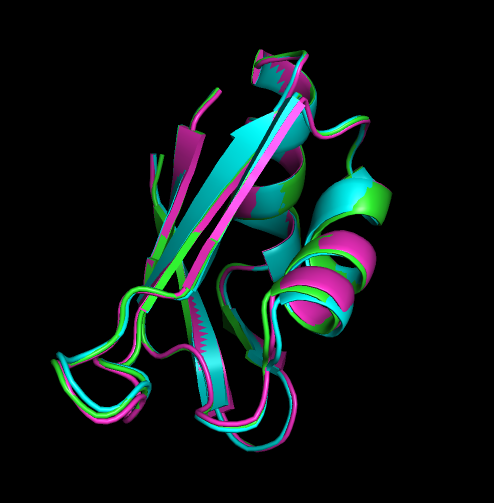
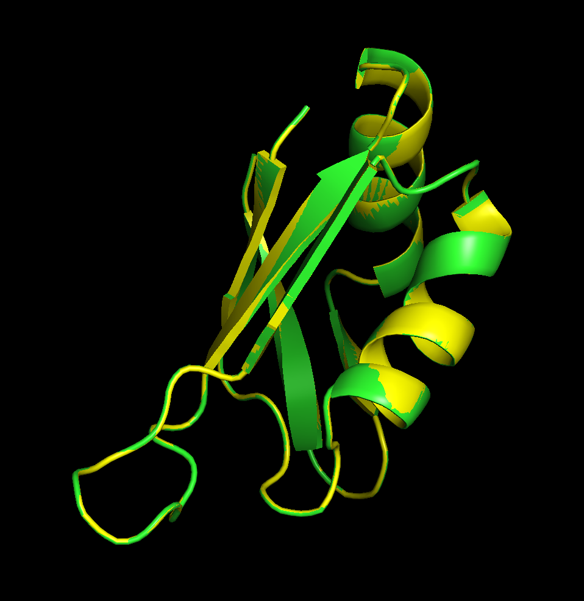
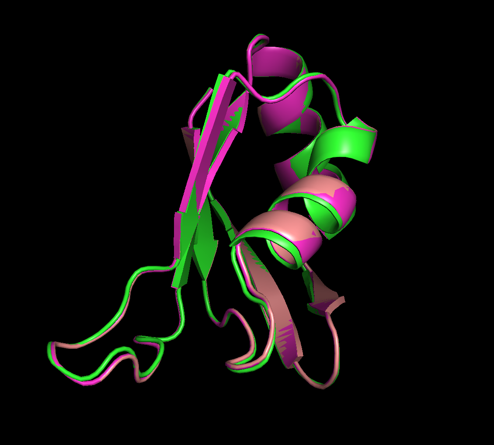
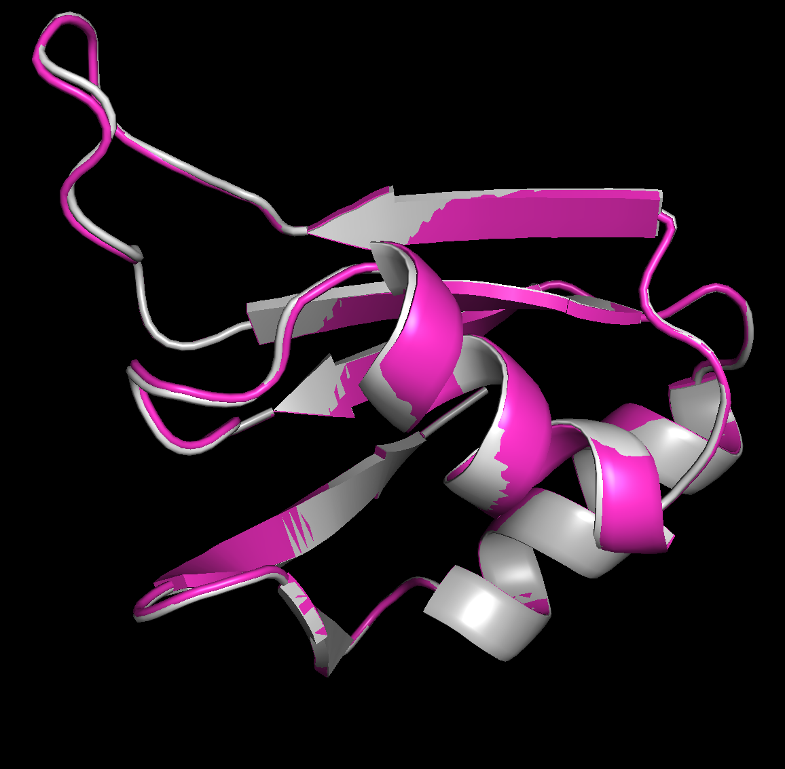

# Rosetta Protocol Exploration 

## Docker Image
1. Dowload docker image (4 GB total)
```angular2html
docker pull rosettacommons/rosetta:latest
```
2. Give docker containers permission to access metl-sim folder on docker app.
3. Start a mounted docker container 
```angular2html
docker run -it -v /path/to/metl-sim/rosetta_protocol:/rosetta rosettacommons/rosetta:latest /bin/bash  
```

4. Open `rosetta_protocol` in the docker container. 

## Protocols 

To explore behavior of different protocols I will use the pab1 structure (`structure.pdb`). I will then introduce a mutation (`L55A` - 1 indexing in chain A) and run the FastRelax Protocol.

Below are all the flags for each experiment I ran. The first are changes to Sri's current protocol, followed by experiments on behaviors of interest. 

- Changes to current All Atom Relax Protocol
  - `flags_relax_v1` - Starting FastRelax Protocol (Cartesian Minimization) 
  - `flags_relax_v3` - Switch mutation scheme so all residues are repacked, not only the residue that was mutated. 
Add flag to stop ignorning weight from xml script, from `ref2015` weights to `beta_nov16_cart`. 
- Side Experiments on Parameter behavior
  - `flags_default_max_cycles` -  Confirm behavior controls in some behavior related to the number of minimization steps. 
  - `flags_loops_minimize_max_iter` - Confirm this parameter does nothing.
  - `flags_restrict_repack` - Restrict repacked residues to those within a 10 Å distance.
  - `flags_restrict_backbone` - 


### Recommendations

1) Change current all atom relax script in `metl-sim`
2) Do sweep over `default_max_cycles`, `repeat`, `restrict_repack_distance`, and `restrict_backbone_distance`.


### Outputs for each run
- console output: `<flag>.log` 
- pdb output: `<flag>_structure_0001.pdb`
- score file output: `<flag>.sc`


### Changes to the All Atom Relax Protocol


> Note: All protocols in these tests do 10 relax repeats. 
> Within each repeat minimization and repack is done 4 times (as shown in output log).
> So for 10 repeats, minimization and repack is done 40 times. 
> I did this to make sure that we would see movement of sidechains and backbone.
> However, the current number of repeats is 1. 
> We likely should test this in the same against 
> the default (recommended) 5 and see how much information is lost.


First we will run the original protocol. 
```angular2html
time rosetta_scripts @flags_relax_v1 > flags_relax_v1.log 2>&1

# xml: relax_v1.xml
# total_score:  -296.420  
# timing: 

real    1m46.206s
user    1m46.142s
sys     0m0.048s
```

Things to note:

2) The protocol looks to be using the `ref2015` loss function. 
Since no `-beta_nov16_cart` flag in command line. Below is a snippet of the relevant parts 
of the log file. 

```angular2html
core.scoring.ScoreFunctionFactory: [ WARNING ] **************************************************************************
*****************************************************
****************************************************
beta_nov16_cart may be a 'beta' scorefunction, but ScoreFunctionFactory thinks the beta flags weren't set.  Your scorefunction may be garbage!
**************************************************************************
*****************************************************
****************************************************


core.scoring.ScoreFunctionFactory: SCOREFUNCTION: ref2015
```

2) The repack only selects the mutated residue. The command `55 A PIKAA A`
in `mutation.resfile` only allows design at position 55, which restricts the allowed repacking. 

```angular2html
core.pack.interaction_graph.interaction_graph_factory: Instantiating PDInteractionGraph
protocols.relax.FastRelax: CMD: repack  -278.071  0  0  0.03245
protocols.relax.FastRelax: CMD: scale:fa_rep  -276.544  0  0  0.0506
protocols.relax.FastRelax: CMD: min  -388.857  0.815343  0.815343  0.0506
protocols.relax.FastRelax: CMD: coord_cst_weight  -388.857  0.815343  0.815343  0.0506
protocols.relax.FastRelax: CMD: scale:fa_rep  -310.272  0.815343  0.815343  0.154
core.pack.pack_rotamers: built 1 rotamers at 1 positions.
```

Fixed version: 

```angular2html
time rosetta_scripts @flags_relax_v3 > flags_relax_v3.log 2>&1

# xml: relax_v3.xml
# total_score: -237.867 
# timing: 
real    1m31.047s
user    1m30.965s
sys     0m0.069s

```

Confirmation in relevant outputs.
```angular2html
# flags_relax_v3.log
core.scoring.ScoreFunctionFactory: SCOREFUNCTION: beta_nov16_cart.wts


protocols.rosetta_scripts.ParsedProtocol: =======================BEGIN MOVER MutateResidue - mutant=======================


core.pack.task: Packer task: initialize from command line() 
core.pack.pack_rotamers: built 1089 rotamers at 75 positions.
core.pack.interaction_graph.interaction_graph_factory: Instantiating DensePDInteractionGraph
protocols.relax.FastRelax: CMD: repack  -276.718  0.233159  0.233159  0.03245
protocols.relax.FastRelax: CMD: scale:fa_rep  -274.624  0.233159  0.233159  0.0506
protocols.relax.FastRelax: CMD: min  -323.155  0.663634  0.663634  0.0506
protocols.relax.FastRelax: CMD: coord_cst_weight  -323.155  0.663634  0.663634  0.0506


###  flags_relax_v3_structure_0001.pdb

ATOM    816  N   ALA A  55     -19.908  22.128  -0.997  1.00  0.00           N  
ATOM    817  CA  ALA A  55     -20.359  22.205   0.383  1.00  0.00           C  
ATOM    818  C   ALA A  55     -21.289  21.050   0.748  1.00  0.00           C  
ATOM    819  O   ALA A  55     -21.170  20.478   1.842  1.00  0.00           O  
ATOM    820  CB  ALA A  55     -21.059  23.524   0.615  1.00  0.00           C  
ATOM    821  H   ALA A  55     -20.138  22.883  -1.651  1.00  0.00           H  
ATOM    822  HA  ALA A  55     -19.481  22.149   1.025  1.00  0.00           H  
ATOM    823 1HB  ALA A  55     -21.366  23.597   1.656  1.00  0.00           H  
ATOM    824 2HB  ALA A  55     -20.379  24.341   0.373  1.00  0.00           H  
ATOM    825 3HB  ALA A  55     -21.934  23.580  -0.027  1.00  0.00           H  

```


The three structures below are compared, and it is clear the two protocols produce different outputs. 
Although the protocol is stochastic, large deviations like this were not observed if the same protocol 
was run twice. 



Shown above (green-original pab1-`structure.pdb`, original all atom relax- `flags_relax_v1_structure_0001.pdb` - blue,
fixed all atom relax - `flags_relax_v3_structure_0001.pdb` - hot pink)


### Parameter `-default_max_cycles`

This parameter, can be set by the user and is used in FastRelax. It controls the minimization steps. (not repack steps)

Confirmation of correctness from rosetta slack:
> Frank DiMaio Apr 22nd, 2021 at 11:54 AM
:this (at least on quick glance) looks good to me ... the only thing we do "differently" in relax is limit the max # of minimization cycles to 200.  This is controlled with a flag (-default_max_cycles) or through a relax "script file"  (https://new.rosettacommons.org/docs/latest/application_documentation/structure_prediction/relax#description-of-algorithm)


```angular2html
time rosetta_scripts @flags_relax_default_max_cycles > flags_relax_default_max_cycles.log 2>&1

# xml: relax_v3.xml
# total_score:   -213.100   
# timing:
real    0m9.672s
user    0m9.609s
sys     0m0.055s


# flags_relax_default_max_cycles.log

core.pack.pack_rotamers: built 985 rotamers at 75 positions.
core.pack.interaction_graph.interaction_graph_factory: Instantiating DensePDInteractionGraph
protocols.relax.FastRelax: CMD: repack  -236.488  0.0156695  0.0156695  0.3124
protocols.relax.FastRelax: CMD: scale:fa_rep  -231.915  0.0156695  0.0156695  0.34815
core.optimization.Minimizer: [ WARNING ] LBFGS MAX CYCLES 1 EXCEEDED, BUT FUNC NOT CONVERGED!
protocols.relax.FastRelax: CMD: min  -233.736  0.0159546  0.0159546  0.34815

```

You can also confirm by looking in pymol at the comparison between the two structures 
and seeing no obvious minimization. Especially if set to 0.



Shown above (green-original pab1-`structure.pdb`,default_max_cycles set to 1 - `flags_relax_default_max_cycles_structure_0001.pdb` - yellow)


### Parameter `-loops:minimize_max_iter`
```angular2html
time rosetta_scripts @flags_relax_minimize_max_iter > flags_relax_minimize_max_iter.log 2>&1
# xml: relax_v3.xml
# total_score: -237.808 
# timing:

real    1m36.783s
user    1m35.816s
sys     0m0.943s
```

Although read in by Rosetta arg parser, this parameter is not exposed to the Rosetta FastRelax protocol. 
For example, the C alpha carbons clearly moved despite setting 
this parameter to 0 which shouldn’t be possible in the only
repack setting.


Shown above (green-original pab1-`structure.pdb`, fixed all atom relax - `flags_relax_v3_structure_0001.pdb` - hot pink, 
minimize_max_iter set to zero - `flags_relax_minimize_max_iter_structure_0001.pdb` - tan)


### Parameter Restrict Repack 

First need to verify that the `ResidueSelector` we are using 
```angular2html
From Rosetta Docs: https://docs.rosettacommons.org/docs/latest/scripting_documentation/RosettaScripts/ResidueSelectors/ResidueSelectors

NeighborhoodResidueSelector
<Neighborhood name=(%string) resnums=(%string) distance=(10.0%float)/>
or

<Neighborhood name=(%string) selector=(%string) distance=(10.0%float)/>
or

<Neighborhood name=(%string) distance=(10.0%float)>
   <Selector ... />
</Neighborhood>
  
The NeighborhoodResidueSelector selects all the residues
  within a certain distance 
  cutoff of a focused set of residues.
It sets each position in the ResidueSubset that corresponds
  to a residue within a certain distance of the focused set
  of residues as well as the residues in the focused set
  to true, and sets all other positions to false
```

It looks like the residue itself is also chosen. 
You can also confirm this by setting the distance to 0 Å.


```angular2html
time rosetta_scripts @flags_restrict_repack > flags_restrict_repack.log 2>&1

# xml: relax_v4.xml
# total_score: -232.173
# timing: 
real    1m25.923s
user    1m25.818s
sys     0m0.087s
```

And we can confirm the output is only looking at 16-17 residues to pack rotamers,
it must find a new neighborhood after every run. 

```angular2html
# flags_restrict_repack.log
core.pack.pack_rotamers: built 139 rotamers at 16 positions.
core.pack.interaction_graph.interaction_graph_factory: Instantiating DensePDInteractionGraph
protocols.relax.FastRelax: CMD: repack  -217.146  0  0  0.03245
protocols.relax.FastRelax: CMD: scale:fa_rep  -215.458  0  0  0.0506
protocols.relax.FastRelax: CMD: min  -317.338  0.688015  0.688015  0.0506
protocols.relax.FastRelax: CMD: coord_cst_weight  -317.338  0.688015  0.688015  0.0506
```

It's hard to confirm this one visually since the repacking also effects the minimization.
So residues that are more than 10 Å away also change, for example the disorder region in the upper left.



Shown above (fixed all atom relax - `flags_relax_v3_structure_0001.pdb` - hot pink, 
restricted repack set to 10 Å from mutated residue - `flags_restrict_repack_structure_0001.pdb` - silver)


### Parameter - Restrict Minimizer Distance

Restricting the distance of the minimizer. 


#### Constraints Investigation